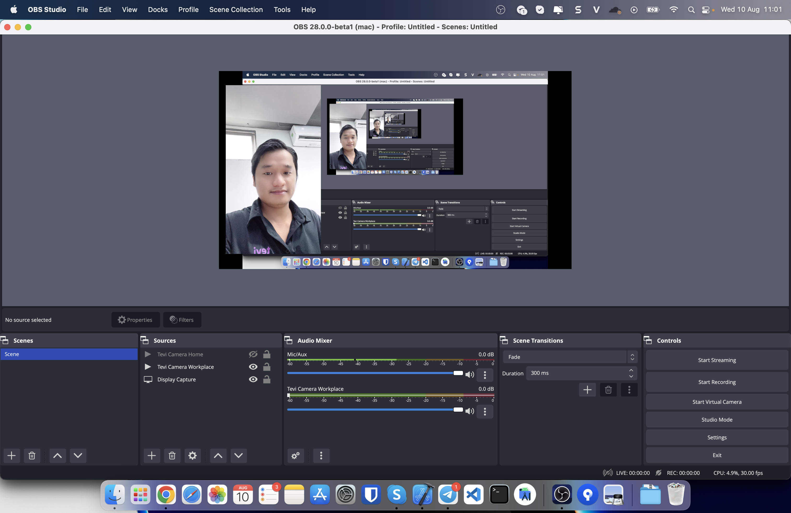
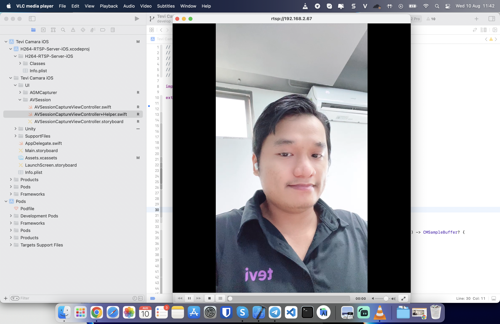

# IPHONE CAMERA FOR OBS

The app will turn your camera into a media input source for OBS and streamlab. The technique used is RTSP and streaming over the local network.

## Step to run example:

1. Run this project with xcode, build to your iphone device
2. You will see **rtsp address** display on screen, enter it to VLC to test your connection.
3. Open OBS/Streamlab on computer:
3.1 Source -> Ad(+) -> Media source
3.2 Untick option Local file
3.3 Enter your **iphone address** on field Input, address like: rtsp://192.168.2.67
4. Go live






## Example code:

**Setup And Start Capture Session**
```swift
func setupAndStartCaptureSession(){
        
        //init session
        self.captureSession = AVCaptureSession()
        //start configuration
        self.captureSession.beginConfiguration()
        
        //session specific configuration
        if self.captureSession.canSetSessionPreset(.hd1280x720) {
            self.captureSession.sessionPreset = .hd1280x720
        }
                
        //setup inputs
        self.setupInputs()
        
        //setup output
        self.setupOutput()
        
        //commit configuration
        self.captureSession.commitConfiguration()
        //start running it
        self.captureSession.startRunning()
}
```

**Setup Inputs**
```swift
func setupInputs(){
        //get back camera
        if let device = AVCaptureDevice.default(.builtInWideAngleCamera, for: .video, position: .back) {
            backCamera = device
        } else {
            //handle this appropriately for production purposes
            fatalError("no back camera")
        }
        
        //get front camera
        if let device = AVCaptureDevice.default(.builtInWideAngleCamera, for: .video, position: .front) {
            frontCamera = device
        } else {
            fatalError("no front camera")
        }
        
        //now we need to create an input objects from our devices
        guard let bInput = try? AVCaptureDeviceInput(device: backCamera) else {
            fatalError("could not create input device from back camera")
        }
        backInput = bInput
        if !captureSession.canAddInput(backInput) {
            fatalError("could not add back camera input to capture session")
        }
        
        guard let fInput = try? AVCaptureDeviceInput(device: frontCamera) else {
            fatalError("could not create input device from front camera")
        }
        frontInput = fInput
        if !captureSession.canAddInput(frontInput) {
            fatalError("could not add front camera input to capture session")
        }
        
        //connect back camera input to session
        captureSession.addInput(frontInput)
}
```

**Setup Output**
```swift
func setupOutput(){
        let videoQueue = DispatchQueue(label: "videoQueue", qos: .userInteractive)
        videoOutput = AVCaptureVideoDataOutput()
        videoOutput.setSampleBufferDelegate(self, queue: videoQueue)
        let setcapSettings:[String : Any] = [
            kCVPixelBufferPixelFormatTypeKey as String : NSNumber(value: Int32(kCVPixelFormatType_420YpCbCr8BiPlanarVideoRange))
        ]
        videoOutput.videoSettings = setcapSettings
        
        if captureSession.canAddOutput(videoOutput) {
            captureSession.addOutput(videoOutput)
        } else {
            fatalError("could not add video output")
        }
        
        videoOutput.connections.first?.videoOrientation = .portrait
        videoOutput.connections.first?.isVideoMirrored = !backCameraOn
}
```

**Switch Camera Input**
```swift
func switchCameraInput(){
        //don't let user spam the button, fun for the user, not fun for performance
        //switchCameraButton.isUserInteractionEnabled = false
        
        //reconfigure the input
        captureSession.beginConfiguration()
        if backCameraOn {
            captureSession.removeInput(backInput)
            captureSession.addInput(frontInput)
            backCameraOn = false
        } else {
            captureSession.removeInput(frontInput)
            captureSession.addInput(backInput)
            backCameraOn = true
        }
        
        //deal with the connection again for portrait mode
        videoOutput.connections.first?.videoOrientation = .portrait
        
        //mirror video if front camera
        videoOutput.connections.first?.isVideoMirrored = !backCameraOn
        
        //commit config
        captureSession.commitConfiguration()
        
        //acitvate the camera button again
        //switchCameraButton.isUserInteractionEnabled = true
}
```
**Setup Metal View**
```swift
func setupMetal(){
        //fetch the default gpu of the device (only one on iOS devices)
        metalDevice = MTLCreateSystemDefaultDevice()
        
        //tell our MTKView which gpu to use
        cameraView.device = metalDevice
        
        //tell our MTKView to use explicit drawing meaning we have to call .draw() on it
        cameraView.isPaused = true
        cameraView.enableSetNeedsDisplay = false
        
        //create a command queue to be able to send down instructions to the GPU
        metalCommandQueue = metalDevice.makeCommandQueue()
        
        //conform to our MTKView's delegate
        cameraView.delegate = self
        
        //let it's drawable texture be writen to
        cameraView.framebufferOnly = false
}
    
func setupCoreImage(){
        ciContext = CIContext(mtlDevice: metalDevice)
}
```
**Setup Encoder RTSP Server**
```swift
    func setupAndStartEncoder() {
        encoder = AVEncoder(forHeight: 1280, andWidth: 720)
        encoder?.encode({ [weak self] data, pts in
            if let rtsp = self?.rtsp, let encoder = self?.encoder {
                rtsp.bitrate = encoder.bitspersecond
                rtsp.onVideoData(data, time: pts)
            }
            return 0
            
        }, onParams: { [weak self] data in
            self?.rtsp = RTSPServer.setupListener(data)
            return 0
        })
    }
```
**AVCapture Video Data Output SampleBuffer Delegate**
```swift
    func captureOutput(_ output: AVCaptureOutput, didOutput sampleBuffer: CMSampleBuffer, from connection: AVCaptureConnection) {
        
        if let pixelBuffer = CMSampleBufferGetImageBuffer(sampleBuffer), let faceunityPixelBuffer = processingManager?.processFrame(pixelBuffer: pixelBuffer) {
            
            //Push video frame to RTSP server
            guard let newSampleBuffer = createCMSampleBuffer(filteredPixelBuffer: faceunityPixelBuffer, originalSampleBuffer: sampleBuffer) else { return }
            
            //render video to preview view
            let ciImage = CIImage(cvImageBuffer: faceunityPixelBuffer)
            self.currentCIImage = ciImage
            cameraView.draw()
            
            //push video to encoder rtsp
            guard let encoder = encoder else { return }
            encoder.encodeFrame(newSampleBuffer)
        }
    }
```

**MTKViewDelegate**
```swift
    func draw(in view: MTKView) {
        //create command buffer for ciContext to use to encode it's rendering instructions to our GPU
        guard let commandBuffer = metalCommandQueue.makeCommandBuffer() else {
            return
        }
        
        //make sure we actually have a ciImage to work with
        guard let ciImage = currentCIImage else {
            return
        }
        
        guard let currentDrawable = view.currentDrawable else {
            return
        }
        
        //transform the image to aspect-fit the view's bounds
        let drawableSize = view.drawableSize
        let scaleX = drawableSize.width / ciImage.extent.width
        let scaleY = drawableSize.height / ciImage.extent.height
        let scale = min(scaleX, scaleY)
        let scaledImage = ciImage.transformed(by: CGAffineTransform(scaleX: scale, y: scale))
        // center in the view
        let originX = max(drawableSize.width - scaledImage.extent.size.width, 0) / 2
        let originY = max(drawableSize.height - scaledImage.extent.size.height, 0) / 2
        let centeredImage = scaledImage.transformed(by: CGAffineTransform(translationX: originX, y: originY))
        
        // Create a render destination that allows to lazily fetch the target texture
        // which allows the encoder to process all CI commands _before_ the texture is actually available.
        // This gives a nice speed boost because the CPU doesn't need to wait for the GPU to finish
        // before starting to encode the next frame.
        // Also note that we don't pass a command buffer here, because according to Apple:
        // "Rendering to a CIRenderDestination initialized with a commandBuffer requires encoding all
        // the commands to render an image into the specified buffer. This may impact system responsiveness
        // and may result in higher memory usage if the image requires many passes to render."
        let destination = CIRenderDestination(width: Int(drawableSize.width),
                                              height: Int(drawableSize.height),
                                              pixelFormat: view.colorPixelFormat,
                                              commandBuffer: nil,
                                              mtlTextureProvider: { () -> MTLTexture in
            return currentDrawable.texture
        })
        // render into the view's drawable
        let _ = try! self.ciContext.startTask(toRender: centeredImage, to: destination)
        
        // present the drawable
        commandBuffer.present(currentDrawable)
        commandBuffer.commit()
    }
```

**Setup Permissions**
```swift
    func checkPermissions() {
        let cameraAuthStatus =  AVCaptureDevice.authorizationStatus(for: AVMediaType.video)
        switch cameraAuthStatus {
        case .authorized:
            return
        case .denied:
            abort()
        case .notDetermined:
            AVCaptureDevice.requestAccess(for: AVMediaType.video, completionHandler: {(authorized) in
                if(!authorized) {
                    abort()
                }
            })
        case .restricted:
            abort()
        @unknown default:
            fatalError()
        }
    }
```

**Create CMSampleBuffer**
```swift
    func createCMSampleBuffer(filteredPixelBuffer:CVPixelBuffer, originalSampleBuffer:CMSampleBuffer) -> CMSampleBuffer? {
        
        var timingInfo = CMSampleTimingInfo()
        guard CMSampleBufferGetSampleTimingInfo(
            originalSampleBuffer,
            at: 0,
            timingInfoOut: &timingInfo) == 0 else {
            llog("Failure in CMSampleBufferGetSampleTimingInfo")
            return nil
        }
        
        var formatDescription: CMVideoFormatDescription?
        if CMVideoFormatDescriptionCreateForImageBuffer(
            allocator: kCFAllocatorDefault,
            imageBuffer: filteredPixelBuffer,
            formatDescriptionOut: &formatDescription) != noErr {
            llog("Failure in CMVideoFormatDescriptionCreateForImageBuffer")
            return nil
        }
        
        var newSampleBuffer: CMSampleBuffer?
        if let formatDescription = formatDescription {
            if CMSampleBufferCreateReadyWithImageBuffer(
                allocator: kCFAllocatorDefault,
                imageBuffer: filteredPixelBuffer,
                formatDescription: formatDescription,
                sampleTiming: &timingInfo,
                sampleBufferOut: &newSampleBuffer) != noErr {
                llog("Failure in CMSampleBufferCreateReadyWithImageBuffer")
                return nil
            }
        }
        
        return newSampleBuffer
    }
```